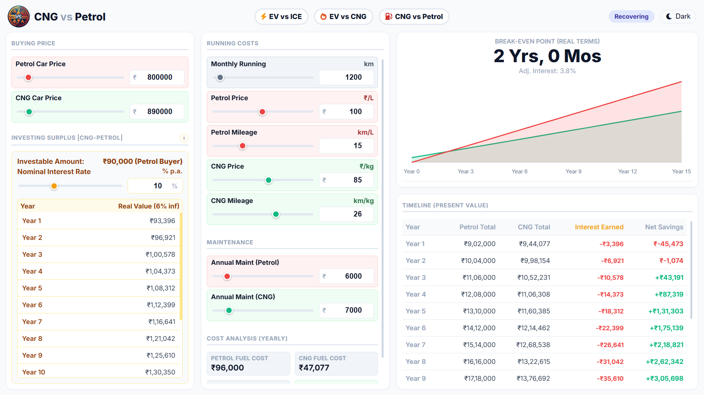

# 🇮🇳 Indian Car Cost Calculator (EV vs ICE & CNG vs Petrol)

### 🔴 [Click Here to Use the Calculator](https://carscalc.netlify.app)
*(Hosted on Netlify)*

---

## 🧐 The Problem
Deciding between a Petrol, CNG, or EV car is confusing. Most calculators only check "Fuel Savings." They ignore **Opportunity Cost**—the interest you lose by paying a higher upfront cost for an EV/CNG car.

I built this tool to calculate the **Real Break-Even Point**, adjusted for:
* **Inflation (6%)**
* **Lost Investment Returns (SIP/FD)**
* **Maintenance Differences**

## 📸 Screenshots

### 1. EV vs ICE Comparison

### 1. EV vs CNG Comparison

### 2. CNG vs Petrol Comparison

## 🚀 Features
* **Inflation Adjusted:** Calculates Present Value of future savings.
* **Investment Comparison:** Compares car savings vs. investing the price difference.
* **Privacy First:** No data is sent to servers; runs 100% in your browser.

---
*Created by [Sudhanshu Gausinga]*